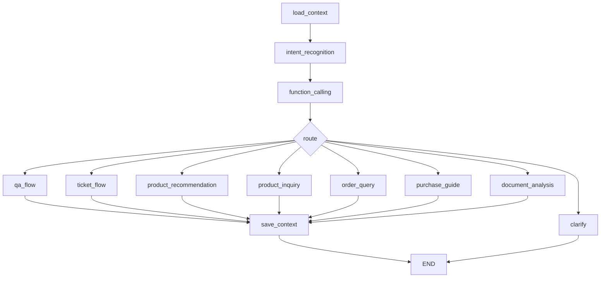
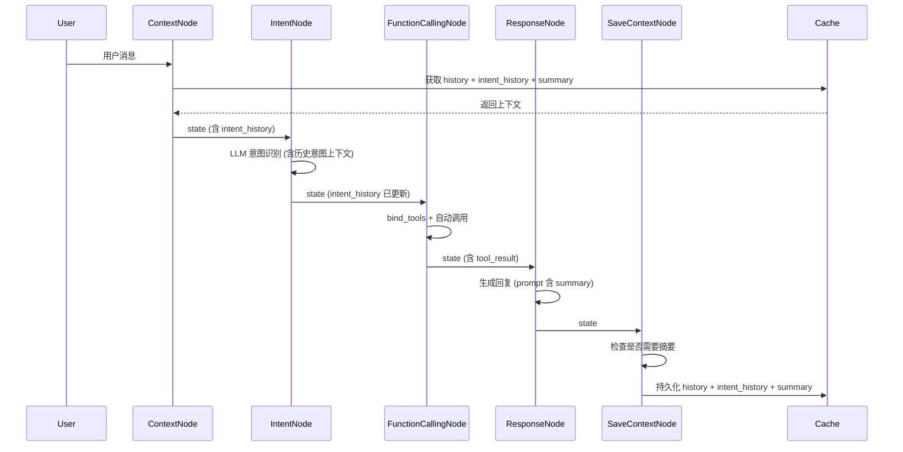

# 设计文档：AI 工作流增强

## 概述

本设计文档描述三项 AI 工作流增强功能的技术实现方案：

1. **多轮对话意图追踪** — 在 `IntentRecognitionNode` 中引入意图历史，利用前序意图辅助当前分类
2. **迁移至 LangChain 原生 Tool Binding** — 用 `@tool` 装饰器 + `bind_tools` 替代自定义 JSON Schema 匹配
3. **对话摘要压缩机制** — 在上下文管理中引入 LLM 摘要，压缩早期对话以保留关键信息

三项改进均在现有 LangGraph 工作流架构内实现，不改变工作流的整体拓扑结构。

## 架构

### 当前工作流拓扑



### 改动后的工作流拓扑

工作流拓扑保持不变，改动集中在以下节点内部：

| 节点 | 改动内容 |
|------|---------|
| `load_context` | 加载 intent_history 和 conversation_summary |
| `intent_recognition` | 接收 intent_history，输出更新后的 intent_history |
| `function_calling` | 使用 `bind_tools` 替代自定义 JSON Schema 匹配 |
| `save_context` | 持久化 intent_history；触发摘要生成 |
| `qa_flow` 等响应节点 | 在 prompt 中注入 conversation_summary |

### 数据流变化



## 组件与接口

### 组件 1：IntentTracker（意图追踪器）

位置：`backend/services/ai/nodes/intent_node.py`

修改现有 `IntentRecognitionNode`，增加意图历史管理。

```python
# 新增的 prompt 模板，包含意图历史上下文
SYSTEM_PROMPT_WITH_HISTORY = """只输出一个意图标签，不要输出任何其他内容。

标签：问答|工单|商品推荐|商品咨询|购买指导|订单查询|文档分析

最近的意图历史（从旧到新）：
{intent_history}

规则：
- 如果用户消息意图明确，直接输出对应标签
- 如果用户消息意图模糊，参考最近的意图历史推断
- 如果用户明确切换话题，输出新话题的标签
...（保留现有规则）"""

PROMPT_WITH_HISTORY = ChatPromptTemplate.from_messages([
    ("system", SYSTEM_PROMPT_WITH_HISTORY),
    ("human", "{message}")
])
```

接口变化：
- `execute(state)` 从 `state["intent_history"]` 读取历史意图
- `execute(state)` 将新意图追加到 `state["intent_history"]`
- 当置信度低于 `INTENT_FALLBACK_THRESHOLD`（默认 0.6）时，使用最近高置信度意图作为回退

### 组件 2：LangChain Tool Binding

位置：`backend/services/function_tools.py` + `backend/services/ai/nodes/function_calling_node.py`

#### 工具定义（使用 `@tool` 装饰器）

```python
from langchain_core.tools import tool

@tool
async def query_order(order_no: str) -> dict:
    """查询订单详情和状态。可以通过订单号查询订单信息、商品列表、支付状态等。
    
    Args:
        order_no: 订单号，格式如：ORD20240207123456
    """
    # ... 现有 QueryOrderTool.execute 逻辑
```

#### FunctionCallingNode 改造

```python
class FunctionCallingNode(BaseNode):
    def __init__(self, llm):
        super().__init__(llm)
        self.tools = [query_order, search_products, get_user_info, 
                      check_inventory, get_logistics, calculate_price]
        self.llm_with_tools = llm.bind_tools(self.tools)
        self.tool_map = {t.name: t for t in self.tools}
    
    async def execute(self, state: ConversationState) -> ConversationState:
        # 跳过不需要工具的意图
        skip_intents = {"问答", "文档分析", "工单"}
        if state.get("intent") in skip_intents:
            state["tool_result"] = None
            state["tool_used"] = None
            return state
        
        # 构建消息并调用 LLM
        messages = self._build_messages(state)
        response = await self.llm_with_tools.ainvoke(messages)
        
        # 解析 tool_calls
        if response.tool_calls:
            tool_results = []
            for tc in response.tool_calls:
                tool_fn = self.tool_map[tc["name"]]
                result = await tool_fn.ainvoke(tc["args"])
                tool_results.append({"tool": tc["name"], "result": result})
            state["tool_result"] = tool_results
            state["tool_used"] = ", ".join(tc["name"] for tc in response.tool_calls)
        else:
            state["tool_result"] = None
            state["tool_used"] = None
        
        return state
```

### 组件 3：ConversationSummarizer（对话摘要器）

位置：新建 `backend/services/ai/summarizer.py`

```python
class ConversationSummarizer:
    def __init__(self, llm):
        self.llm = llm
        self.trigger_threshold = settings.SUMMARY_TRIGGER_THRESHOLD  # 默认 10
        self.max_tokens = settings.CONTEXT_MAX_TOKENS  # 默认 3000
    
    def should_summarize(self, history: list) -> bool:
        """判断是否需要触发摘要"""
        return len(history) > self.trigger_threshold
    
    async def summarize(self, history: list, existing_summary: str = "") -> dict:
        """生成摘要，返回 {"summary": str, "remaining_history": list}"""
        # 将 threshold 之前的消息 + 已有摘要 压缩为新摘要
        # 保留 threshold 之后的消息作为 remaining_history
        ...
    
    def fallback_truncate(self, history: list) -> dict:
        """摘要失败时的回退截断策略"""
        return {
            "summary": "",
            "remaining_history": history[-self.trigger_threshold:]
        }
```

摘要 Prompt：

```python
SUMMARY_PROMPT = ChatPromptTemplate.from_messages([
    ("system", """请将以下对话历史压缩为一段简洁的摘要。
保留以下关键信息：
- 用户的主要意图和需求
- 提及的具体商品名称、订单号
- 已解决的问题和结论
- 用户的偏好信息

已有摘要：
{existing_summary}

请输出更新后的摘要，不超过 500 字。"""),
    ("human", "对话历史：\n{history_text}")
])
```

### 组件 4：ContextNode 和 SaveContextNode 改造

#### ContextNode 变化

```python
class ContextNode(BaseNode):
    async def execute(self, state: ConversationState) -> ConversationState:
        context = await redis_cache.get_context(state["session_id"])
        if context:
            state["conversation_history"] = context.get("history", [])
            state["user_profile"] = context.get("user_profile", {})
            state["intent_history"] = context.get("intent_history", [])
            state["conversation_summary"] = context.get("conversation_summary", "")
        else:
            state["conversation_history"] = []
            state["user_profile"] = {}
            state["intent_history"] = []
            state["conversation_summary"] = ""
        state["timestamp"] = datetime.now().isoformat()
        return state
```

#### SaveContextNode 变化

```python
class SaveContextNode(BaseNode):
    def __init__(self, llm=None):
        super().__init__(llm)
        self.summarizer = ConversationSummarizer(llm) if llm else None
    
    async def execute(self, state: ConversationState) -> ConversationState:
        # 添加新消息
        await redis_cache.add_message_to_context(
            session_id=state["session_id"],
            user_message=state["user_message"],
            assistant_message=state["response"]
        )
        
        # 更新意图历史
        await redis_cache.update_context(
            session_id=state["session_id"],
            last_intent=state.get("intent"),
            intent_history=state.get("intent_history", [])
        )
        
        # 检查是否需要摘要
        if self.summarizer:
            context = await redis_cache.get_context(state["session_id"])
            history = context.get("history", [])
            if self.summarizer.should_summarize(history):
                try:
                    result = await self.summarizer.summarize(
                        history, 
                        context.get("conversation_summary", "")
                    )
                    await redis_cache.update_context(
                        session_id=state["session_id"],
                        history=result["remaining_history"],
                        conversation_summary=result["summary"]
                    )
                except Exception:
                    truncated = self.summarizer.fallback_truncate(history)
                    await redis_cache.update_context(
                        session_id=state["session_id"],
                        history=truncated["remaining_history"]
                    )
        
        return state
```

## 数据模型

### ConversationState 扩展

```python
class ConversationState(TypedDict):
    # ... 现有字段保持不变 ...
    
    # 新增字段
    intent_history: Optional[List[Dict[str, Any]]]
    # 格式: [{"intent": "商品咨询", "confidence": 0.9, "turn": 3}, ...]
    
    conversation_summary: Optional[str]
    # 格式: 纯文本摘要字符串
```

### Intent History 条目结构

```python
{
    "intent": str,        # 意图标签
    "confidence": float,  # 置信度 0.0-1.0
    "turn": int,          # 对话轮次序号
    "timestamp": str      # ISO 格式时间戳
}
```

### Redis Cache 上下文结构变化

```python
# 现有结构
{
    "history": [{"user": str, "assistant": str, "timestamp": str}],
    "user_profile": dict,
    "last_intent": str,
    "updated_at": str
}

# 新增字段
{
    "history": [...],
    "user_profile": dict,
    "last_intent": str,
    "intent_history": [{"intent": str, "confidence": float, "turn": int, "timestamp": str}],
    "conversation_summary": str,
    "updated_at": str
}
```

### 配置项扩展（config.py）

```python
# 意图追踪配置
INTENT_HISTORY_SIZE: int = 5          # 提供给 LLM 的意图历史条数
INTENT_FALLBACK_THRESHOLD: float = 0.6  # 回退到历史意图的置信度阈值

# 对话摘要配置
SUMMARY_TRIGGER_THRESHOLD: int = 10   # 触发摘要的对话轮数阈值
CONTEXT_MAX_TOKENS: int = 3000        # 上下文最大 token 数
```

### LangChain Tool 定义（替代 FunctionTool 基类）

```python
# 使用 @tool 装饰器，每个工具是一个独立的 async 函数
# 参数通过函数签名 + docstring 自动生成 schema
# 不再需要 FunctionTool 抽象基类和 FunctionToolManager

@tool
async def query_order(order_no: str) -> dict:
    """查询订单详情和状态。"""
    ...

@tool  
async def search_products(keyword: str, max_price: float = None,
                          difficulty: str = None, tech_stack: list[str] = None) -> dict:
    """搜索毕业设计商品。"""
    ...

# 工具列表
all_tools = [query_order, search_products, get_user_info, 
             check_inventory, get_logistics, calculate_price]
```


## 正确性属性（Correctness Properties）

*属性是指在系统所有合法执行路径中都应成立的特征或行为——本质上是对系统应做什么的形式化陈述。属性是人类可读规格说明与机器可验证正确性保证之间的桥梁。*

### Property 1: 意图历史每轮增长一条

*For any* ConversationState 和任意用户消息，执行一次 IntentRecognitionNode 后，intent_history 的长度应比执行前恰好增加 1，且新增条目的 intent 字段为本轮识别结果。

**Validates: Requirements 1.1**

### Property 2: Prompt 中仅包含最近 N 条意图历史

*For any* intent_history（长度任意），构建意图识别 prompt 时，prompt 中包含的意图历史条目数应等于 `min(len(intent_history), INTENT_HISTORY_SIZE)`，且为 intent_history 的尾部子序列。

**Validates: Requirements 1.2**

### Property 3: 低置信度回退到最近高置信度意图

*For any* intent_history 中包含至少一条置信度 ≥ 阈值的条目，当 LLM 返回的意图置信度低于 `INTENT_FALLBACK_THRESHOLD` 时，最终输出的意图应等于 intent_history 中最近一条置信度 ≥ 阈值的意图。

**Validates: Requirements 1.3**

### Property 4: 上下文持久化往返一致性

*For any* 合法的上下文数据（包含 history、intent_history、conversation_summary），将其保存到 Redis_Cache 后再加载，应得到与原始数据等价的结果。

**Validates: Requirements 1.6, 3.7**

### Property 5: Tool Call 正确分发

*For any* LLM 响应中包含的 tool_calls 列表，FunctionCallingNode 应对每个 tool_call 调用名称匹配的工具函数，并将参数正确传递。state 中的 tool_used 应包含所有被调用工具的名称。

**Validates: Requirements 2.2**

### Property 6: 无 Tool Call 时跳过工具执行

*For any* LLM 响应中 tool_calls 为空的情况，FunctionCallingNode 执行后 state 的 tool_result 应为 None，tool_used 应为 None。

**Validates: Requirements 2.5**

### Property 7: 工具异常不中断工作流

*For any* 工具执行抛出异常的情况，FunctionCallingNode 应捕获异常并在 tool_result 中记录错误信息，而非向上抛出异常导致工作流中断。

**Validates: Requirements 2.6**

### Property 8: 工具 Schema 向后兼容

*For any* 现有六个工具，新的 `@tool` 装饰器版本生成的 JSON Schema 应与原 `FunctionTool.get_schema()` 返回的 Schema 在参数名称、类型和必填项上保持一致。

**Validates: Requirements 2.7**

### Property 9: 摘要触发阈值判定

*For any* 对话历史列表，`should_summarize(history)` 返回 True 当且仅当 `len(history) > SUMMARY_TRIGGER_THRESHOLD`。

**Validates: Requirements 3.1**

### Property 10: 摘要保留尾部历史

*For any* 长度超过阈值的对话历史，摘要后的 remaining_history 应为原始历史的尾部子序列，且 summary 为非空字符串。remaining_history 的每条消息应与原始历史对应位置的消息完全相同。

**Validates: Requirements 3.2, 3.3**

### Property 11: 摘要注入 QA Prompt

*For any* 非空的 conversation_summary，QA_Node 构建的 prompt 文本中应包含该 summary 的完整内容。

**Validates: Requirements 3.4**

### Property 12: 摘要后 Token 数不超限

*For any* 摘要结果，summary 文本加上 remaining_history 的总估算 token 数应不超过 `CONTEXT_MAX_TOKENS`。

**Validates: Requirements 3.5**

### Property 13: 摘要异常时回退截断

*For any* 对话历史，当摘要 LLM 调用失败时，fallback_truncate 应返回原始历史的最后 `SUMMARY_TRIGGER_THRESHOLD` 条消息（或全部消息，如果历史长度不足阈值）。

**Validates: Requirements 3.6**

## 错误处理

| 场景 | 处理策略 |
|------|---------|
| 意图识别 LLM 调用失败 | 降级为"问答"意图，置信度设为 0.5，不更新 intent_history |
| 意图历史加载失败 | 使用空 intent_history，不影响当前轮识别 |
| bind_tools 后 LLM 返回格式异常 | 捕获解析异常，跳过工具调用，按无工具路由处理 |
| 工具执行超时或异常 | 在 tool_result 中记录错误信息，继续路由到对应响应节点 |
| 摘要 LLM 调用失败 | 回退到截断策略，保留最近 N 轮原文 |
| 摘要结果超过 token 限制 | 递归截断 remaining_history 直到满足限制 |
| Redis Cache 读写失败 | 使用空上下文继续处理，日志记录错误 |

## 测试策略

### 属性测试（Property-Based Testing）

使用 `hypothesis` 库（已在 requirements.txt 中）进行属性测试。每个属性测试至少运行 100 次迭代。

每个正确性属性对应一个独立的属性测试，测试标注格式：
**Feature: ai-workflow-enhancement, Property {N}: {property_text}**

测试文件组织：
- `backend/tests/test_intent_tracker_properties.py` — Property 1, 2, 3
- `backend/tests/test_context_persistence_properties.py` — Property 4
- `backend/tests/test_tool_binding_properties.py` — Property 5, 6, 7, 8
- `backend/tests/test_summarizer_properties.py` — Property 9, 10, 11, 12, 13

生成器策略：
- 意图历史生成器：生成随机长度的 intent_history 列表，每条包含随机意图标签和置信度
- 对话历史生成器：生成随机长度的 history 列表，每条包含随机 user/assistant 文本
- Tool Call 生成器：生成随机的 tool_calls 结构，包含合法工具名和参数
- ConversationState 生成器：组合以上生成器构建完整状态

### 单元测试

单元测试聚焦于具体示例和边界情况：
- 新会话初始化时 intent_history 为空（Requirements 1.5）
- 工具迁移后各工具的具体调用示例（Requirements 2.4）
- 摘要触发的边界值（恰好等于阈值、阈值+1）
- 空对话历史的摘要处理
- 各种异常场景的具体错误消息验证

### 测试配置

```python
from hypothesis import settings as hyp_settings

# 属性测试默认配置
hyp_settings.register_profile("ci", max_examples=200)
hyp_settings.register_profile("dev", max_examples=100)
```
